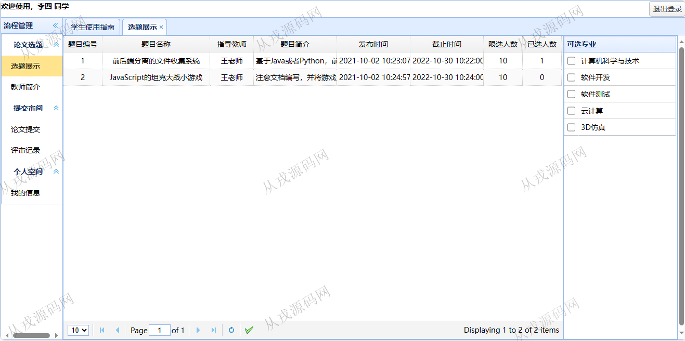
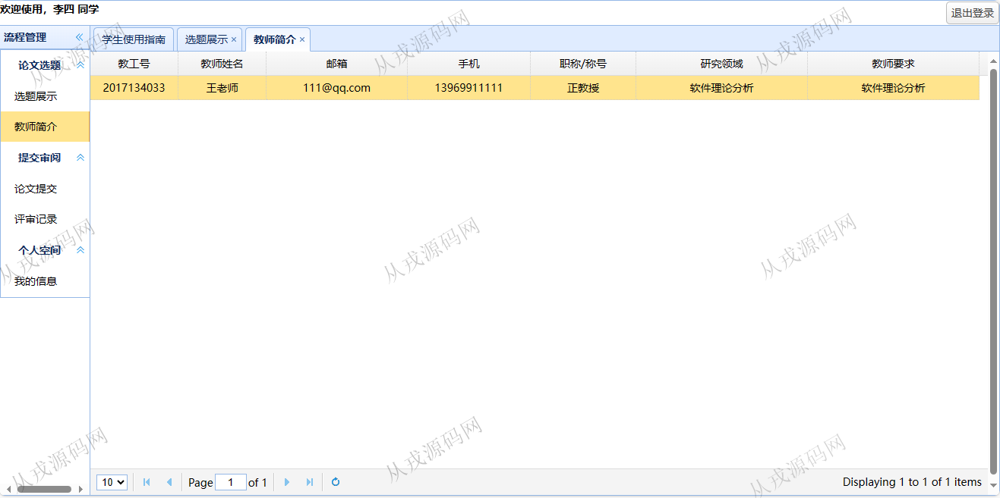
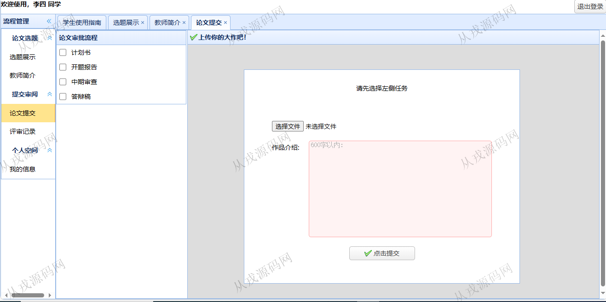
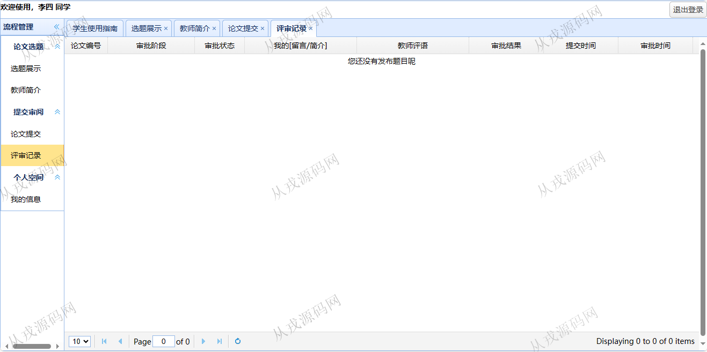
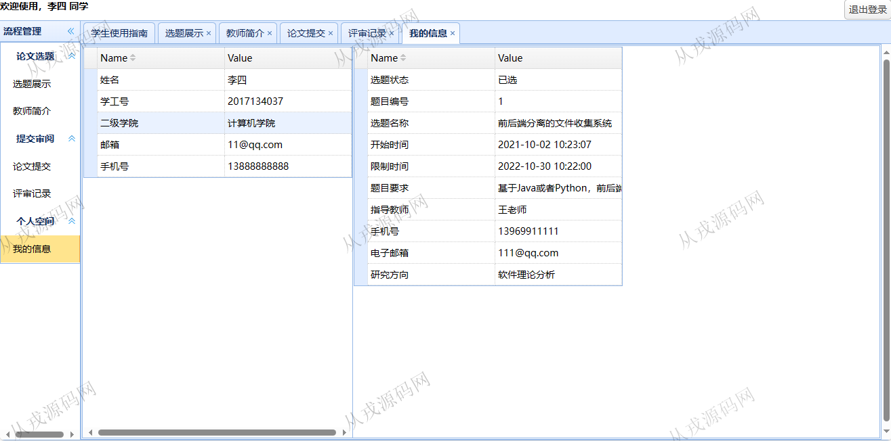
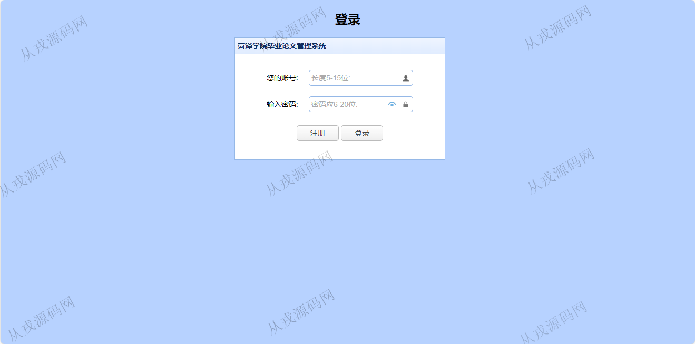
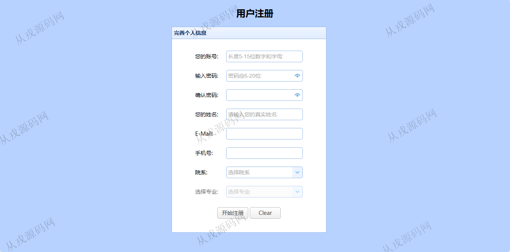

<h1 align="center">116.毕业论文管理系统</h1>

 获取sql文件 QQ: 386869957 QQ群: 377586148 

 [推荐站点: 从戎源码网](https://armycodes.com/) 

## 简介

> 本代码来源于网络,仅供学习参考使用!
>
> 提供1.远程部署/2.修改代码/3.设计文档指导/4.框架代码讲解等服务

> 访问地址: http://localhost:8080/pages/login.html
> 2017134037	wenwen1122

## 项目介绍
基于springboot的毕业论文管理系统：前端 html、jquery、easyui，后端 maven、springmvc、spring、mybatis，角色分为学生、老师；集成选题、专业选择、论文提交、评审记录等功能于一体的系统。

## 功能介绍

- 论文展示：选题列表查询，可选专业
- 教师简介：教师信息列表查询
- 论文提交：计划书，开题报告，中期审查，答辩稿，文件上传
- 评审记录：评审记录列表查询
- 个人空间：我的信息查询，包括选题信息

## 环境

- <b>IntelliJ IDEA 2021.3</b>

- <b>Mysql 5.7.26</b>

- <b>JDK 1.8</b>

- <b>Redis 3.0</b>

## 运行截图

